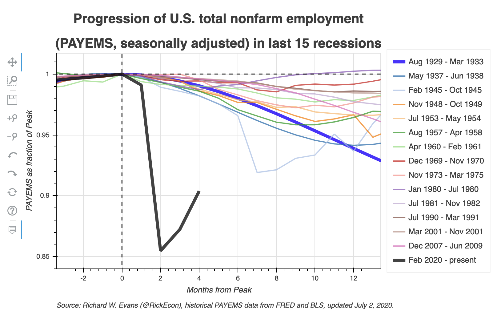
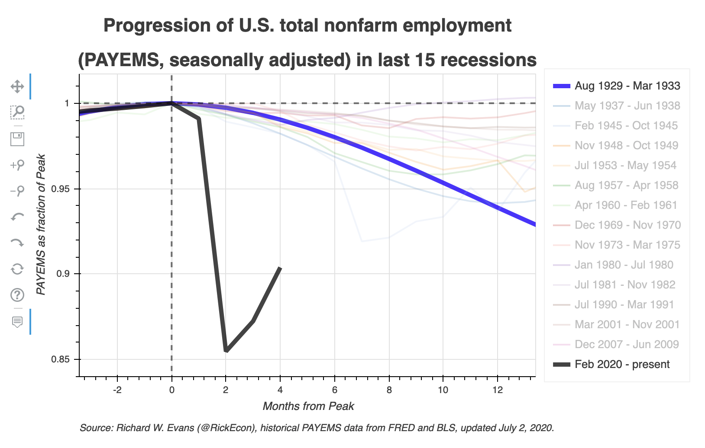
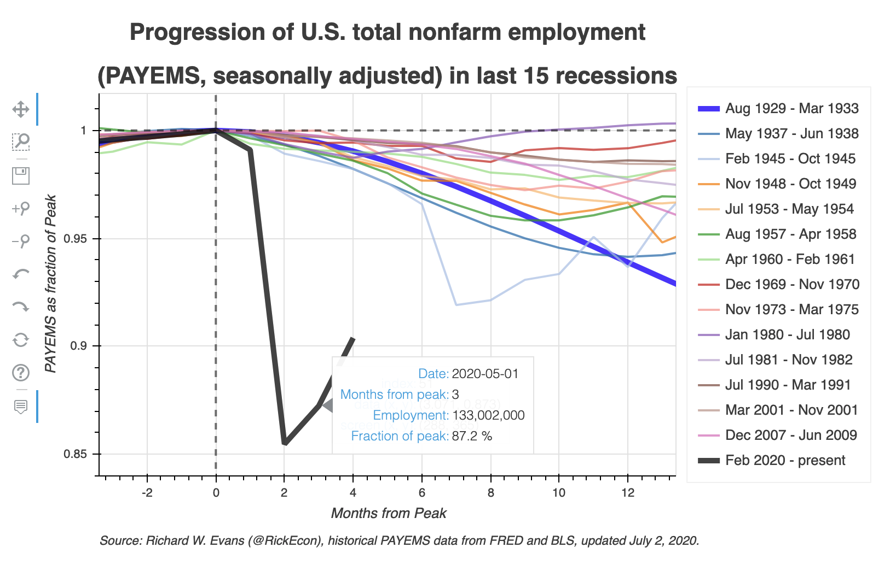
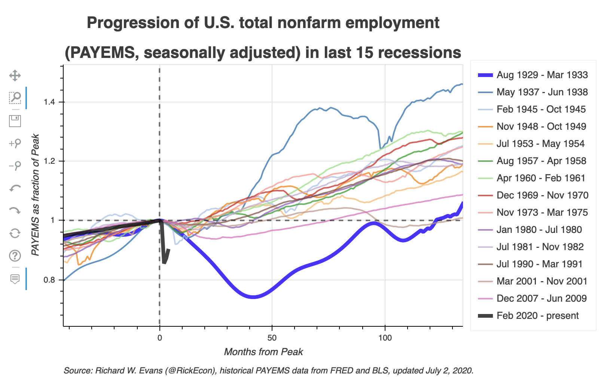

[](https://www.oselab.org/gallery)
[](https://www.python.org/downloads/release/python-374/)
[](https://travis-ci.org/OpenSourceEcon/USgdp_NormPeakPlot)
[](https://codecov.io/gh/OpenSourceEcon/USgdp_NormPeakPlot)

# Normalized Peak Plot of U.S. Real Gross Domestic Product (GDPC1)
The code in this repository allows the user to create a normalized peak plot of U.S. real GDP (GDPC1, seasonally adjusted) over the last 15 recessions, from the Great Depression (Aug. 1929 to Mar. 1933) to the current COVID-19 recession (Feb. 2020 to present). The dynamic version of this plot, which is updated regularly, is available to manipulate and explore at [https://www.oselab.org/gallery/usgdp_npp](https://www.oselab.org/gallery/usgdp_npp). The core maintainer of this repository is [Richard Evans](https://sites.google.com/site/rickecon/) ([@RickEcon](https://github.com/rickecon)).

A normalized peak plot takes the maximum level of U.S. real GDP at the beginning of a recession (within five months or one quarter of the NBER declared beginning month) and normalizes the entire series so that the value at that peak equals 1.0. As such, the normalized time series shows the percent change from that peak. This is an intuitive way to compare the progression of real GDP across recessions. The following figure is a screen shot of the normalized peak plot of the GDPC1 series from data downloaded on July 30, 2020 (most recent real GDP data is Q2 2020).

<!-- The monthly PAYEMS data series begins in January 1939. The U.S. Bureau of Labor Statistics published an annual survey of U.S. nonfarm employment which provided an annual average nonfarm payroll employment (not seasonally adjusted) for the years 1919-1938. I set the date values for annual average data to July 1 of that year. These data are taken from Table 1 on page 1 of the Bureau of Labor Statistics' "[Employment, Hours, and Earnings, United States, 1909-90, Volume I](https://fraser.stlouisfed.org/title/employment-earnings-united-states-189/employment-hours-earnings-united-states-1909-90-5435/content/pdf/emp_bmark_1909_1990_v1)," Bulletin of the United States Bureau of Labor Statistics, No. 2370 (Mar. 1991). In order to have monthly data, I imputed the missing months as a cubic spline that connected the annual data from July 1919 to July 1938 to the first two months of 1939 (January and February 1939). These annual data are stored as a .csv file in this repository ([`data/usempl_anual_1919-1938.csv`](data/usempl_anual_1919-1938.csv)). The imputation takes place in the [`usempl_npp_bokeh.py`](usempl_npp_bokeh.py) file, and the final PAYEMS monthly data series from 1919-07 to 2020-06 with the imputed months is [`data/usempl_2020-06-01.csv`](data/usempl_2020-06-01.csv).



This `README.md` is organized into the following three sections.
1. [Running the code and generating the dynamic visualization](README.md#1-running-the-code-and-generating-the-dynamic-visualization)
2. [Functionality of the dynamic visualization](README.md#2-functionality-of-the-dynamic-visualization)
3. [Contributing to this visualization code](README.md#3-contributing-to-this-visualization-code)

## 1. Running the code and generating the dynamic visualization
The code for creating this visualization is written in the [Python](https://www.python.org/) programming language. It requires the following file:
* [`usempl_npp_bokeh.py`]usempl_npp_bokeh.py): a Python module that defines two functions in order to create the HTML and JavaScript for the dynamic visualization of the U.S. employment normalized peak plot of the last 15 recessions.
    * [`get_usempl_data()`](usempl_npp_bokeh.py#L31) takes inputs for the date ranges to plot and whether to download the data directly from [fred.stlouisfed.org](https://fred.stlouisfed.org/series/PAYEMS) or retrieve the data from a file saved previously on your local hard drive in the [data](data/) directory of this repository. Then the function collects, cleans, and returns the PAYEMS data.
    * [`usempl_npp()`](usempl_npp_bokeh.py#L254) creates the dynamic visualization of the normalized peak plot of the PAYEMS series over the last 15 recessions. This script calls the [`get_usempl_data()`](usempl_npp_bokeh.py#L31) function. It then uses the [`Bokeh`](https://bokeh.org/) library to create a dynamic visualization using HTML and JavaScript to render the visualization in a web browser.

The most standard way to successfully run this code if you are using the [Anaconda distribution](https://www.anaconda.com/products/individual) of Python is to install and activate the `usempl-npp-dev` [conda environment](https://docs.conda.io/projects/conda/en/latest/user-guide/concepts/environments.html) defined in the [environment.yml](environment.yml) file, then run the [`usempl_npp_bokeh.py`](usempl_npp_bokeh.py) module as a script with the defaults or import the [`usempl_npp_bokeh.py`](usempl_npp_bokeh.py) module and run the [`usempl_npp()`](usempl_npp_bokeh.py#L254) function using the appropriate options. Use the following steps.
1. Either fork this repository then clone it to your local hard drive or clone it directly to your local hard drive from this repository.
2. Install the [Anaconda distribution](https://www.anaconda.com/products/individual) of Python to your local machine.
3. Update `conda` and `anaconda` by opening your terminal and typing `conda update conda` and following the instructions, then typing `conda update anaconda` and following the instructions.
4. From the terminal (or Conda command prompt), navigate to the directory to which you cloned this repository and run `conda env create -f environment.yml`. This will create the conda environment with all the necessary dependencies to run the script to create the dynamic visualization.
5. Activate the conda environment by typing in your terminal `conda activate usempl-npp-dev`.
6. Create the visualization in one of two ways.
    * Run the [`usempl_npp_bokeh.py`](usempl_npp_bokeh.py) module as a script with the default settings of the [`usempl_npp()`](usempl_npp_bokeh.py#L254) function. This will produce the dynamic visualization in which the data are downloaded from the internet, the end date is either the month of the current day or the most recent month with PAYEMS data, and then the default months from peak.
    * Import the  [`usempl_npp_bokeh.py`](usempl_npp_bokeh.py) module and execute the [`usempl_npp()`](usempl_npp_bokeh.py#L254) function by typing something like the following:
    ```python
    import usempl_npp_bokeh as usempl

    usempl.usempl_npp(14, 2, 18, 4, '2020-06-22')
    ```
7. Executing the function [`usempl_npp()`](usempl_npp_bokeh.py#L254) will result in three output objects: the dynamic visualization HTML file, the original time series of the PAYEMS series, and the organized dataset of each recession's variables time series for the periods specified in the function inputs.
    * [**images/usempl_npp_[YYYY-mm-dd].html**](images/usempl_npp_2020-06-01.html). This is the dynamic visualization. The code in the file is a combination of HTML and JavaScript. You can view this visualization by opening the file in a web browser window. A version of this visualization is updated regularly on the web at [https://www.oselab.org/gallery/usempl_npp](https://www.oselab.org/gallery/usempl_npp).
    * [**data/usempl_[YYYY-mm-dd].csv**](data/usempl_2020-06-01.csv). A comma separated values data file of the original time series of the PAYEMS series from 1919-01-01 to whatever end date is specified in the [`usempl_npp()`](usempl_npp_bokeh.py#L254) function arguments, which end date is also the final 10 characters of the file name `YYYY-mm-dd`.
    * [**data/usempl_pk_[YYYY-mm-dd].csv**](data/usempl_pk_2020-06-01.csv).

## 2. Functionality of the dynamic visualization
This dynamic visualization allows the user to customize some different views and manipulations of the data using the following functionalities. The default view of the visualization is shown above.
* Highlight or mute specific recession time series by clicking on the series label in the legend on the right side of the plot. The screen shot below shows a version of the plot in which all the recession time series have been muted except for the current COVID-19 recession and the Great Depression. Note that even when muted, the time series are still faintly visible.

*  Hovertool display. If you select the hovertool button  on the left side of the plot, which is the default for the plot, information about each point in each time series will be displayed when you hover your cursor over a given point in the plot area. The screen shot below shows a version of the plot in which the hovertool is selected and the information about the minimum point in the current recession is displayed.

*  Pan different areas of the data. If you click on the pan button  on the left side of the plot, you can use your cursor to click and drag on the data window and change your view of the data.
*    Zoom in or out on the data. You can zoom in or zoom out on the data series in three different ways. You can use the box zoom functionality by clicking on its button  on the left side of the plot and clicking and dragging a box on the area of the plot that you want to zoom in on. You can also zoom in by clicking on the zoom in button  on the left side of the plot, then clicking on the area of the plot you want to center your zoom in around. Or you can zoom out by clicking on the zoom out button  on the left side of the plot, then clicking on the area of the plot you want to center your zoom out around. The screen shot below shows a zoomed out version of the plot.

*  Save current view of data as .png file. You can save your current view of the data as a .png file to your local hard drive by clicking on the save button  on the left side of the plot.
*   Undo and redo actions. You can undo or redo any of the plot changes that you make using the undo button  or the redo button  on the left side of the plot.
*  Reset the plot. After any changes you make to the plot, you can reset it to its original position by using the reset button  on the left side of the plot.

## 3. Contributing to this visualization code
If you wish to improve or enhance this code or if you find errors or bugs, please consider the following ways to contribute to this project.
* Browse the repository [Issues](https://github.com/OpenSourceEcon/USempl_NormPeakPlot/issues) for known areas that need attention.
* Submit questions or suggestions by submitting a new issue in the repository [Issues](https://github.com/OpenSourceEcon/USempl_NormPeakPlot/issues).
* Submit a pull request with your proposed changes. -->
